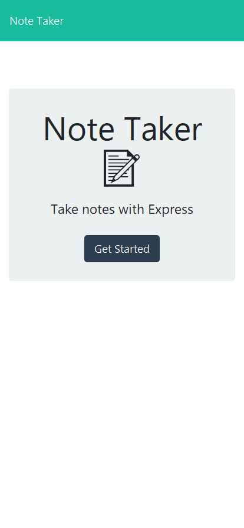
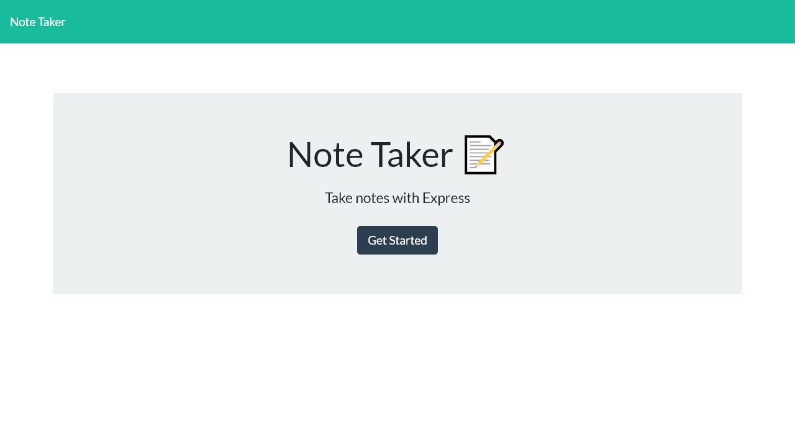

# Note Taker Challenge

This is an application for taking notes. You can write notes and save them and delete them. The application uses an Express.js back end to serve the data from a JSON file. 

## Table of Contents
1. [Installation](#installation)
1. [Usage](#usage)
   1. [Screenshots](#screenshots)
1. [License](#license)
1. [Contributing](#contributing)
1. [Tests](#tests)
1. [Questions](#questions)

## Installation
npm i

## Usage
Saved notes are presented on the left. Click on a saved note to read it or click on the trash can icon to delete the note. On top right you can click the + icon to add a new note and once the note is written you can click on the disk icon to save the note.
### Screenshots
[Live Deployed Link](https://frozen-fjord-78000.herokuapp.com/)
### Mobile

### Browser

  

## License
[MIT License](https://mit-license.org/)
  

## Contributing
n/a

## Tests
n/a

## Questions
[Find me on Github](https://github.com/tbellenger)

Or you can contact me at tbellenger@gmail.com if you have any questions

